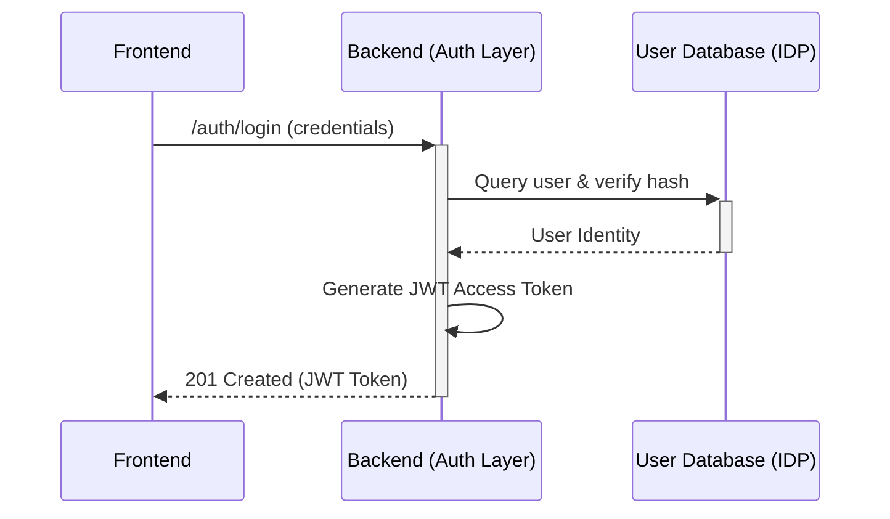
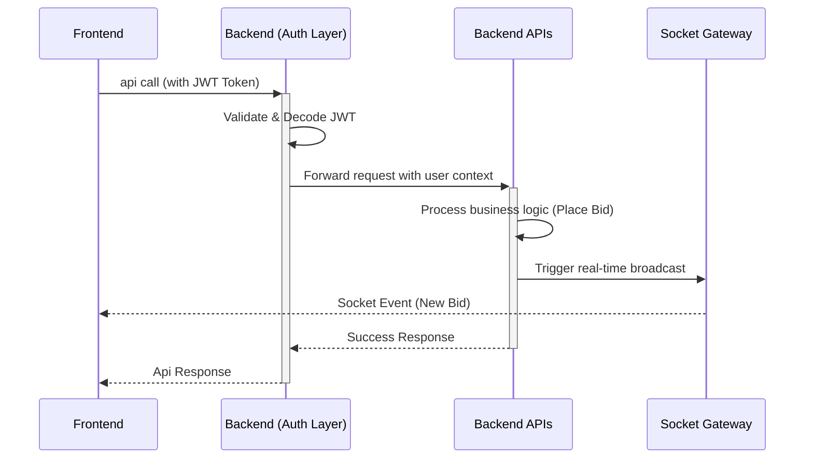
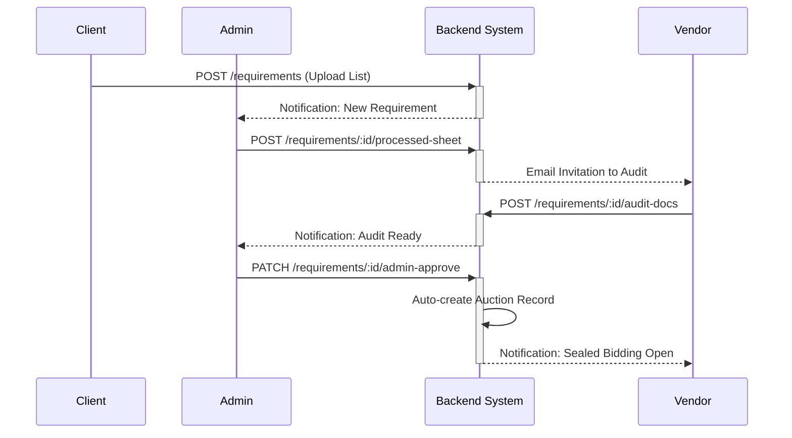

# EcoLoop Backend Schema & Request Flows

This document provides a comprehensive overview of the EcoLoop backend architecture, data models, API endpoints, and business logic flows.

## Tech Stack
- **Framework**: NestJS (TypeScript)
- **ORM**: Prisma
- **Database**: PostgreSQL
- **Storage**: AWS S3 (for documents, photos, and spreadsheets)
- **Real-time**: Socket.io (for live auctions)
- **Task Queue**: BullMQ / Redis (for emails and scheduled tasks)

---

## 1. Database Schema (Prisma Models)

The database is modularized into several Prisma schema files.

### 1.1 User & Company (`users.prisma`)
- **User**: Represents individual accounts (Admin, Client, Vendor, User).
  - Fields: `email`, `passwordHash`, `role`, `status`, `companyId`, etc.
- **Company**: Represents organizations (Clients or Vendors).
  - Fields: `name`, `type`, `status` (PENDING, APPROVED, etc.), `rating`, `bankDetails`, etc.
- **KycDocument**: Documents uploaded for company verification (GST, PAN, etc.).

### 1.2 Requirements & Audits (`requirements.prisma`)
- **Requirement**: A request by a Client to dispose of e-waste.
  - Fields: `title`, `status`, `rawS3Key` (original list), `processedS3Key` (cleaned list), `invitedVendorIds`, etc.
- **AuditInvitation**: Request for a vendor to conduct a site audit.
- **AuditReport**: Detailed report submitted by a vendor after site audit.
- **VendorAuditDoc**: Administrative tracking of audit documents (Excel sheets, photos).

### 1.3 Auctions & Bids (`auctions.prisma`)
- **Auction**: The bidding event created from a Requirement.
  - Fields: `status` (DRAFT, SEALED_PHASE, OPEN_PHASE, etc.), `basePrice`, `targetPrice`, `winnerId`, etc.
- **Bid**: Individual bids placed by vendors. Supports both `SEALED` and `OPEN` phases.
- **AuctionDocument**: Documents specific to an auction (e.g., Sale Order, Work Order).

### 1.4 Post-Auction Flow (`post-auction.prisma`)
- **Payment**: Tracking of client payments to EcoLoop.
- **Pickup**: Tracking the logistics of moving e-waste from Client to Vendor.
- **PickupDocument**: Logistics documents (Gate Pass, Weight Slips, Form 6, Recycling Certificates).
- **Rating**: Mutual ratings between Client and Vendor after completion.

### 1.5 User Products (C2B) (`user-products.prisma`)
- **UserProduct**: Individual consumer e-waste listings.
- **UserProductQuote**: Quotes provided by vendors for consumer products.
- **UserProductPickup**: Logistics for consumer product pickup.

---

## 2. API Endpoints

### 2.1 Authentication (`/auth`)
- `POST /register`: Create a new user/company.
- `POST /login`: Authenticate and receive JWT.
- `GET /profile`: Get current user info.
- `POST /send-otp`: Send OTP for email/phone verification.
- `POST /verify-otp`: Verify OTP code.
- `POST /forgot-password`: Initiate password reset.
- `POST /reset-password`: Reset password using OTP.

### 2.2 Companies (`/companies`)
- `POST /`: Create company details.
- `GET /`: List companies (filter by type/status).
- `GET /:id`: Get company details.
- `PATCH /:id/status`: Update company status (Admin).
- `POST /:id/documents`: Upload KYC documents.
- `PATCH /admin/:id/lock`: Lock a vendor for policy violations.
- `POST /admin/:id/penalty`: Apply financial penalty to a vendor.

### 2.3 Requirements (`/requirements`)
- `POST /`: Client uploads a new requirement (Excel + docs).
- `POST /:id/processed-sheet`: Admin uploads cleaned sheet and invites vendors.
- `PATCH /:id/invitation-respond`: Vendor accepts/declines invitation.
- `POST /:id/audit-docs`: Vendor uploads audit report and site photos.
- `PATCH /:id/audit-docs/:docId/review`: Admin approves vendor's audit.
- `POST /:id/sealed-bid-event`: Admin sets deadline for sealed bids.
- `POST /:id/sealed-bid`: Vendor submits initial price bid.
- `PATCH /:id/client-approve-live`: Client approves parameters for live auction.
- `PATCH /:id/admin-approve`: Admin converts requirement to a live Auction.

### 2.4 Auctions (`/auctions`)
- `GET /`: List auctions by status.
- `GET /:id`: Get auction details (including real-time bid history).
- `POST /:id/sealed-bid`: Submit a sealed bid (with price sheet).
- `POST /:id/live-bid`: Place a bid during the open/live phase.
- `PATCH /:id/winner`: Select the winning vendor (Admin).
- `POST /:id/final-quote`: Winner uploads final signed quotation.
- `PATCH /:id/approve-quote`: Client approves the final quotation.
- `POST /:id/generate-docs`: Admin generates Sale Order/Work Order/Agreement.

### 2.5 Payments & Pickups
- `POST /payments/auction/:auctionId`: Create payment record.
- `PATCH /payments/:id/upload-proof`: Client uploads payment proof (UTR).
- `PATCH /admin/payments/:id/verify`: Admin confirms payment receipt.
- `PATCH /pickups/:id/gate-pass`: Admin/Client issues Gate Pass.
- `PATCH /pickups/:id/vendor-acknowledge`: Vendor confirms logistics details.
- `POST /pickups/:id/reconcile`: Record final actual weight and amount.
- `POST /pickups/:id/generate-invoice`: Generate final invoice.
- `PATCH /admin/pickups/:id/verify-compliance`: Admin verifies recycling certificates.

### 2.6 User Products (C2B) (`/user-products`)
- `POST /`: User lists a product with photos.
- `GET /vendor/open`: Vendors see approved products.
- `POST /:id/quote`: Vendor submits a price quote.
- `PATCH /:id/accept-quote/:quoteId`: User accepts a specific quote.
- `PATCH /:id/pickup-status`: Vendor updates pickup progress.

---

## 3. Key Request & Business Flows

### 3.1 Auction Lifecycle (The "Golden Path")
1. **Listing**: Client uploads e-waste requirement (`POST /requirements`).
2. **Vetting**: Admin processes the sheet and invites qualified Vendors (`POST /requirements/:id/processed-sheet`).
3. **Auditing**: 
    - Vendors accept invitation.
    - Vendors visit site and upload reports (`POST /requirements/:id/audit-docs`).
    - Admin reviews and approves audits.
4. **Sealed Bidding**:
    - Admin starts sealed event.
    - Vendors submit hidden bids (`POST /requirements/:id/sealed-bid`).
5. **Live Auction**:
    - Admin/Client approve live params.
    - Auction goes LIVE.
    - Vendors bid in real-time (`POST /auctions/:id/live-bid`).
    - Anti-sniping: Bids in last 3 mins extend auction.
6. **Selection**: Admin selects winner based on highest bid and compliance history.

### 3.2 Post-Auction & Compliance
1. **Documentation**: Winner uploads final quote; Admin generates legal contracts.
2. **Financials**: Client pays EcoLoop; Admin verifies payment.
3. **Logistics**: 
    - Gate pass issued.
    - Vehicle arrives at client site.
    - Weighment (Empty/Loaded) uploaded.
4. **Closing**:
    - Material reaches Vendor facility.
    - Final weight reconciled.
    - Vendor uploads Recycling/Disposal Certificates.
    - Admin verifies compliance docs and releases payment.

### 4. Visual Request Flows (Sequence Diagrams)

### 4.1 Authentication Flow (Login)

### 4.2 Authorized API Request Flow (e.g., Placing a Bid)

### 4.3 Requirement to Auction Lifecycle

## 5. Security & Integrity
- **JWT Auth**: All sensitive routes require `Authorization: Bearer <token>`.
- **Role-Based Access (RBAC)**: Specific routes restricted to `ADMIN`, `CLIENT`, or `VENDOR`.
- **Idempotency**: Live bidding uses idempotency keys to prevent double-bidding.
- **Audit Trails**: All status changes and document uploads are logged.
